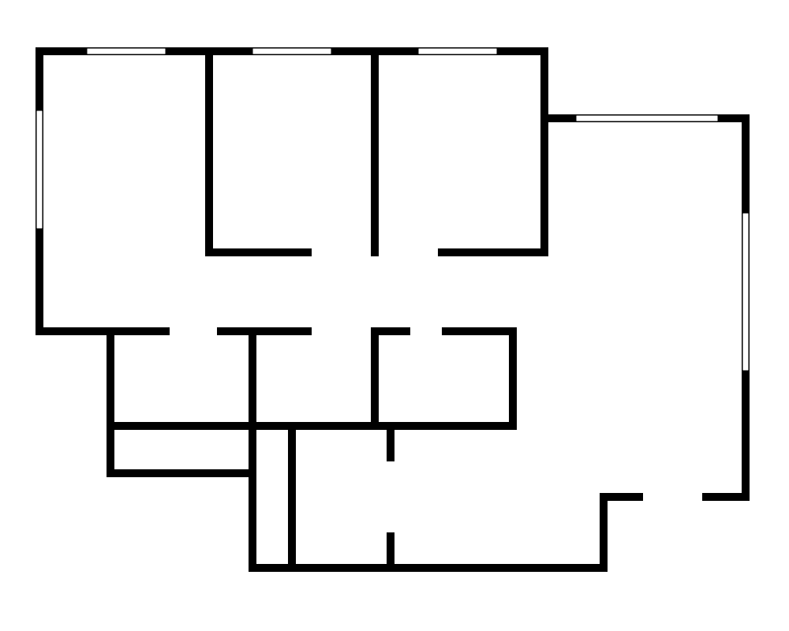

# HDB Sandbox — 3D Interior Designer

An interactive, realistic 3D sandbox of a Singapore HDB 4-room flat for
interior design. Furnish it from a catalog, paint surfaces, light it across
the day, view it as a dollhouse / floor plan / first-person walkthrough, and
export the result — all in the browser.



## Features

- **Accurate HDB 4-room layout** — walls, doors, windows, and room areas
  derived from a measured floor plan; openable doors; a household-shelter
  blast door; and HDB-signature touches like window safety grilles and a
  kitchen backsplash.
- **~75-item furniture catalog** across 15 categories mirroring IKEA's
  departments — beds, seating, tables, storage, kitchen, bathroom, appliances,
  lighting, decor, textiles, outdoor, **electronics**, **kids**, **laundry**,
  and **others** (catch-all) — all parametric (resize / recolour / configure
  form, material, weave, and sheen in the inspector), searchable, with live 3D
  thumbnails. The catalog is **unified** — built-ins, your uploads, installed
  packs, and the browsable CC0 library (Poly Haven) all live in one grid with a
  single search that spans everything; **sort** a category by Featured / Name /
  Size and **filter by max price**; **heart** any item (built-in or CC0) to
  drop it into the **favourites** category (the star tab at the front). The
  drawer reopens to your last category + sort.
  Includes an entryway shoe cabinet, floating + leaning mirrors, wall shelves,
  L-shaped sectional, sideboard, bar cart, room divider, baby crib, potted
  plants in bush / snake-plant / palm forms, and bundled **pool tables in
  6 / 7 / 8 / 9 ft** sizes (a CC-BY model credited in-app). Comes furnished out of the box,
  with one-click **Sets** (vignettes), full-flat **Presets**, and a per-room
  **Tidy up** auto-arranger that follows real interior-design clearances.
- **Realistic materials** — procedurally generated PBR finishes (floors incl.
  oak/walnut/teak planks, **basketweave parquet**, white/grey/charcoal porcelain,
  marble, terrazzo, carpet, concrete; wall paints, wallpapers, **exposed brick**
  and **microcement/concrete** accent walls) plus fabric and wood-grain on
  furniture and a polished-granite worktop. Per-room floor and wall finishes,
  with one-click **"apply to all rooms"**.
  Free textures/models can also be fetched in-app: the **Poly Pizza** pack
  (paste a free API key in the Packs tab → search + download 10,000+ CC0/CC-BY
  models, works on the published site) and the Poly Haven remote catalog
  (CC0 models + textures) work in production; Kenney, ambientCG, the IKEA
  live-scrape, and hand-download sources (Quaternius, Sketchfab, cgbookcase,
  TextureCan, …) are dev-only link/proxy cards since they can't download from a
  static host.
- **Time-of-day lighting** — SunCalc-driven sun for your location, ACES tone
  mapping, image-based lighting, shadows, and real fixture lights
  (lamps, pendants, fans, wall sconces, and signature cove LEDs) that switch
  on at night. An **Auto / On / Off** toggle lights windowless rooms in
  daylight or kills fixtures entirely. A **time-of-day scrub slider** sweeps the
  whole day in one drag, and **window glass tints with the light** — a clear
  cool pane by day, dark and reflective after dark. One-click **lighting moods**
  (Scene menu / ⌘K) preview the room at daylight, golden hour, a cosy evening, or
  night.
- **Selectable 3D backdrop** — choose the surroundings outside the flat from the
  Scene menu: **City** (an HDB estate whose windows light up warm at night),
  **Park** (low-poly trees on a green common), **Hills** (a calm green horizon),
  or **Studio** (a clean, distraction-free ground). The backdrop re-centres on
  whatever floor plan you load.
- **Three views** — orbit (dollhouse with auto wall-reveal), a one-click
  top-down plan (pair with Measurements for an annotated floor plan), a
  first-person walkthrough, plus a **Turntable** auto-orbit for recording a
  presentation clip. Walking uses WASD + mouse-look (pointer-lock) on desktop
  and an on-screen joystick + drag-to-look on touch; a themed, auto-fading
  **controls banner** greets you on entry with the right hints for your device,
  and a live **minimap** (bottom-right) shows where you are and which room
  you're in.
- **View vs. edit** — the orbit (dollhouse) and walk views are **view-only**, for
  looking and presenting; **all** furnishing, customizing and finishing happens
  inside the **per-room editor**. Enter it from the toolbar **Edit** menu →
  **Edit a room**, by **clicking a room's floor** in the overview (which asks
  "Enter <room>?" first, so you don't dive in by accident), or ⌘K.
- **Per-room editor** — an IKEA-planner-style mode that isolates one room to
  plan its furniture (switch rooms from the dropdown beside the **← exit**
  button; **Esc** leaves). Works on the built-in flat **and any custom floor
  plan**. It shows just that room's walls + floor + its own furniture, with the
  camera-facing walls hidden so you always see in, supports orbit **and** walk
  (walk stays view-only), and holds the full catalog/placement/finish/measurement
  tools. It's deliberately
  lightweight — locked to the fast Performance renderer with full-resolution
  models, and skips all the time-of-day/sun/shadow machinery.
- **Editing** — drag to place (with optional **snap-to-grid** and alignment
  guides), move, rotate (**R** key or a touch-friendly **drag-to-rotate ring**
  on the selected item, 15° snap / free with Shift), mirror, **select-all
  (⌘A)**, multi-select with
  align/distribute, **group** (move/rotate as a unit, click again to edit one
  piece), lock, copy/duplicate, **duplicate a row of N**, **apply one item's
  style to all of its type** (right-click), **reset props to defaults**, **rename
  any object** (a custom label shown in the inspector + Objects list), numeric
  position/rotation, undo/redo, save/load named layouts (with thumbnails),
  **export/import a design as a portable `.sofa.json` file**, and PNG export. A
  **Recent** row in the catalog re-surfaces what you just placed.
- **Saved camera views** — bookmark a favourite angle of the flat from the
  **View** menu (each with a **preview thumbnail**) and smoothly fly back to it
  any time (desktop + mobile).
- **Streamlined toolbar** — a compact, scrollable **icon island**: frequent
  actions are one-click icons; related tools tuck into labelled dropdown menus
  (**View** — combined camera Orbit/Walk + top/reset/turntable; **Scene**;
  **Edit** — step into a room / floor-plan editor; **Arrange**; **Tools**;
  **File** — with **Graphics** beside Appearance & Help on the right). Hover any control for its name and
  keyboard shortcut. Scroll the wheel over the island (or click-and-drag it) to
  pan it — the canvas behind never zooms. New view shortcuts: Top view **O**,
  Reset **H**, Tidy **L** (alongside Measurements **M**, Catalog **C**, camera
  **V**, and the editing keys). Layout **presets** and furniture **sets** live in
  the **Arrange** menu; the live **FPS counter** is a toggle in the **Graphics**
  panel. On phones the island collapses to a minimal bar (brand + a hamburger)
  that opens a full-parity bottom sheet — collapsible accordion sections expose
  every desktop action (incl. graphics, appearance, sets/presets/styles,
  save/load), with per-room edit as a single dropdown.
- **Editable floor plan** — a 2D top-down editor to redraw the apartment shell
  (walls with live **length labels**, rooms with live areas, doors/windows, and
  a **per-room ceiling height** for dropped/false ceilings) or
  start from a template; the 3D flat, finishes, and furniture collision all
  follow your custom plan, and plans save to a named library.
- **Design tools** — a SGD **budget** / shopping list (with an optional **budget
  target** that tracks how far over/under you are), door-swing **clearance
  checks**, a **sun study** time-lapse, an auto **walkthrough** tour, point-to-
  point **distance and area measuring** (📌 **Pin** any measurement to keep it as
  a persistent dimension annotation, shown in 3D, the 2D plan, and the report),
  and a printable **design report** (per-room areas, budget, cost-by-room, **cost
  per m²/ft²**, a **finishes-by-room** spec, a **material palette** style board,
  and a **scale-barred, dimensioned floor plan**). Switch all dimension read-outs
  between **metric and imperial** (feet-and-inches) from the Graphics panel.
- **Bring your own models** — import your own furniture as
  `.glb`/`.gltf` **or** `.obj` / `.fbx` / `.stl` / `.ply` / `.dae` / `.3mf` /
  `.usdz`: non-GLB formats are **converted to GLB in your browser** (no upload,
  no server), and every imported model then runs through an **in-browser
  optimize pass** (mesh weld/dedup/prune + Draco, textures re-encoded to
  near-lossless WebP — full resolution kept) so it stays small and smooth. An
  optional **Maximum compression (KTX2)** toggle uses GPU-compressed textures
  when an encoder is available and otherwise falls back to WebP. Uploaded
  **textures/materials** accept the same breadth — PNG / JPG / WebP / BMP /
  **TGA / TIFF / EXR / HDR** — decoded and re-encoded to WebP on import. Imports
  are categorised, searchable, and recolourable like the built-ins. An offline
  pipeline also turns scraped IKEA SG products into rich catalog items
  (colour/finish variants, per-component recolouring, real footprints, and the
  **real product photo** as the catalog thumbnail), with automatic
  **low/medium/high LOD variants** so heavy models stay smooth on modest
  hardware.
- **One-click IKEA catalogue** — the *IKEA Singapore (live scrape)* pack
  (catalog → Packs) downloads models on demand via a local sidecar
  (`npm run scraper-server`): products scrape one-by-one (parallelized), each is
  LOD-optimized the moment it lands, and a per-product progress bar shows the
  run. Categories are auto-detected — no manual tagging — so the whole catalogue
  imports in one click. Local/dev-only — the pack card only appears in a dev
  build; production hides it (importing IKEA model folders still works there).
  IKEA assets are not redistributed.
- **Combine compatible pieces** — drag a mattress onto a bed frame (or select
  the frame and use *Complete with → Place on this*) and it rests snug on the
  frame's actual slatted base (detected from the model's geometry, so a thick
  mattress sits proud above the footboard, as in real life), centred on the
  sleeping area and grouped so the pair moves together. Combining is
  context-aware: dining chairs, stools, and benches arrange **around** a table
  on the floor (not on top), and modular sofa sections snap **edge-to-edge**
  side by side to extend a sofa or form an L-shape.
- **Performance** — four render quality tiers: **Performance / Medium / High /
  Maximum**. **Performance is the default for everyone** — a flat, IKEA-style
  renderer with no real-time shadows, reflections, or post-processing, so the
  scene loads instantly and stays fluid even on laptops/phones without a GPU.
  Medium adds sun shadows + soft reflections; High adds bloom, ambient
  occlusion & antialiasing (lazy-loaded); Maximum maxes everything out for
  strong GPUs. Heavier tiers are opt-in from the Graphics panel; an adaptive
  guard only ever steps *down* to hold 30+ fps, and every setting is overridable
  and persisted. A separate **Asset quality** control (Auto / Low / Medium /
  Original) sets model + texture detail independently of the render effects, so
  you can view full-resolution assets (e.g. IKEA products) on any render tier.
  The offline LOD pass can bake **KTX2 / Basis** GPU-compressed textures
  (`optimize:glb --ktx2`) for a further runtime-memory win. The app also
  **paints its UI instantly** instead of waiting on saved-data restore, so
  there's no blank-screen gap on first load.
- **Loading screen** — an aesthetic overlay (soft warm gradient + a looping
  line-art room that furnishes itself) covers the initial load and masks the
  transitions into walkthrough and the per-room editor, with a contextual
  caption ("Furnishing your flat…", "Entering walkthrough…", "Entering room…").
  It fades quickly on fast loads and respects reduced-motion preferences.
- **One warm design system, four themes** — a domestic, Singapore-rooted
  interface authored in OKLCH: **Clay** (terracotta), **Kampong** (garden
  green), **Porcelain** (teal-jade), and **Estate** (HDB ochre), each in
  light + dark (or **Auto**, following your OS). Switch from the toolbar's
  **Appearance** menu; the whole UI — toolbar, catalog, inspector, nav cluster,
  panels, modals — recolours instantly and your choice persists.
- **Simple / Pro interface** — a mode toggle (in the **Appearance** menu) for when
  the full feature set is more than you need. **Simple** (the default) keeps the
  crucial interior-design workflow and hides advanced clusters, options and fields
  (analysis Tools, numeric transform fields, graphics internals, sun direction,
  saved views, …) and collapses the inspector's sections by default; **Pro** shows
  everything. Persists per device.
- **Guided product tour** — an *interactive* spotlight walkthrough for new users
  that steps through the whole workflow in order (look around → step into a room
  → add furniture → move & customise → paint walls/floors → set the time of day &
  backdrop). The highlighted control stays clickable and **performing the real
  action advances the tour** — clicks elsewhere are harmless, and only the
  explicit **Skip tour** button (or Esc) ends it. Launch it from onboarding, the
  Help modal, or ⌘K.
- **Pro-tool interactions** — a **⌘K command palette** (fuzzy search across
  actions, panels, views, and "add furniture"), a **right-click context menu**
  on any placed piece, an **Objects / Layers** view (items grouped by room with
  a name **filter** + select / lock / hide / delete), a first-run **onboarding** intro, and a fused
  compass + zoom rail. Responsive down to phones, where floating panels become
  bottom sheets.
- **Production-grade panels** — **Swap with similar** (replace a piece in place
  with same-category alternatives, each tagged with a footprint-fit badge),
  **Clearance & fit checks** (HDB door-swing validation with a summary + fix
  suggestions), **Versions** (save / restore named layout snapshots with
  thumbnails), a **Shopping list + Saved collections** (heart any catalog card),
  and **Share & export** (shareable link + a real PNG snapshot). The **2D
  floor-plan editor** and **upload dialogs** are fully theme-aware in light and
  dark.
- **Smart Start** — pick a style and the whole flat is furnished + the walls and
  floors finished in one click (from onboarding, the ⌘K palette, or the Arrange
  menu).
- **2D⇄3D layout** — the floor-plan editor shows your furniture as a top-down
  layout (click to select, drag to move); press **P** to flip between the 2D
  plan and the 3D scene. Drop a **floor-plan photo** to trace over (calibrate its
  scale, adjust opacity), or — with your own API key — let **AI walls** draft the
  plan for you.
- **AI photoreal export** *(experimental, bring-your-own-key)* — turn the current
  view into a photoreal image from the Share modal.
- **Share a plan link** — "Copy plan link" in the Share modal encodes the whole
  design into a `#/plans/<code>` URL that opens the exact design on any device
  (no account or server needed).
- **Live SG prices** *(dev-only)* — toggle real IKEA Singapore prices + buy links
  in the Shopping list (`npm run price-server`); falls back to a built-in estimate.
- **Feature flags + admin** *(dev/admin)* — a central registry decides what ships
  to production; sign in as admin (`#/login`) to unlock dev-only features and a
  flags panel that toggles features for the session (overrides via localStorage
  or a `?ff=feature:off` URL param; production is locked to the registry).

The render loop is **on-demand** — the scene draws only while something is
animating or you're interacting, and pauses entirely when the tab is hidden, so
it stays cool and battery-friendly on low-end laptops.

## Controls

`drag` orbit · `scroll` zoom · `click` select / open doors · `⌘K` command
palette · `right-click` context menu · `R` rotate · `Del` delete ·
`⌃Z`/`⇧⌃Z` undo/redo · `⌃C`/`⌃V`/`⌃D` copy/paste/duplicate · `⌃A` select all · `C` catalog ·
`M` measurements · `T` cycle time · `O` top view · `H` reset view · `L` tidy ·
`P` 2D⇄3D floor plan · `?` help · `V` orbit/walk · in walk: `WASD` move, `E` doors.

## Develop

```bash
npm install
npm run dev          # localhost:5173
npm test             # vitest
npm run build        # typecheck + production build
npm run check        # Biome: format + lint (report only)
npm run check:fix    # Biome: apply safe format + lint fixes
npm run format       # Biome: format-write all files
npm run lint         # Biome: lint only
npm run optimize:glb          # generate low/medium LOD variants (WebP textures)
npm run optimize:glb -- --ktx2 # …with KTX2/Basis GPU-compressed textures (needs `toktx` on PATH)
npm run scraper-server # local sidecar for the IKEA live-scrape pack (dev-only)
npm run price-server   # local sidecar for live IKEA SG budget prices (dev-only)
npm run docs:dev       # VitePress user guide (dev server)
npm run docs:build     # build the user guide into dist/docs
npm run build:all      # app + user guide together (used by the Pages deploy)
```

A **pre-commit hook** (`.githooks/pre-commit`, auto-installed by `npm install`
via the `prepare` script) runs `biome check` on staged files and blocks any
commit with formatting/lint errors. Bypass in a pinch with `git commit
--no-verify`.

Offline asset tooling (an IKEA SG model scraper + GLB analysis) lives under
`python/scripts/` and is not part of the app build. The *IKEA Singapore (live
scrape)* pack drives that scraper through `npm run scraper-server`: start it
alongside `npm run dev`, open the catalog's Packs tab, and click *Scrape IKEA
catalogue* — assets land in (gitignored) `public/assets/ikea/`.

## Documentation

- **User guide** — a VitePress site under `docs/user/`, deployed at
  `/sofa-so-good/docs/` and reachable in-app via the **User guide** (book) button
  in the toolbar, the Help modal, and the ⌘K command palette. Build it with
  `npm run docs:build` (or preview with `npm run docs:dev`).
- **Developer guide** — maintainer docs under `docs/developer/` (plain Markdown,
  not deployed): architecture, per-system guides, and how-to recipes. Start at
  `docs/developer/index.md`. `CLAUDE.md` is the terse always-current index.

## More

Stack: React + TypeScript, three.js via @react-three/fiber, Zustand, Vite.
See [CLAUDE.md](CLAUDE.md) for architecture and how to add content. Bundled
assets are procedurally generated (CC0-equivalent) wherever possible; the few
bundled GLBs (e.g. the pool tables) carry their real licence + attribution
(CC-BY where required), surfaced in the inspector and `CREDITS.md`. Imported
IKEA models retain IKEA's licensing and are not redistributed.
