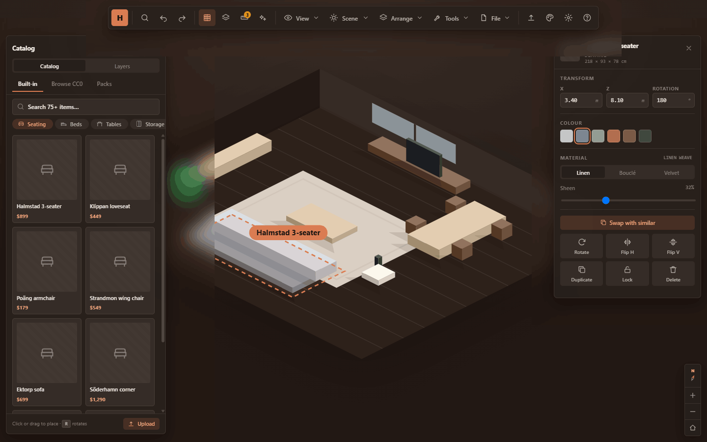
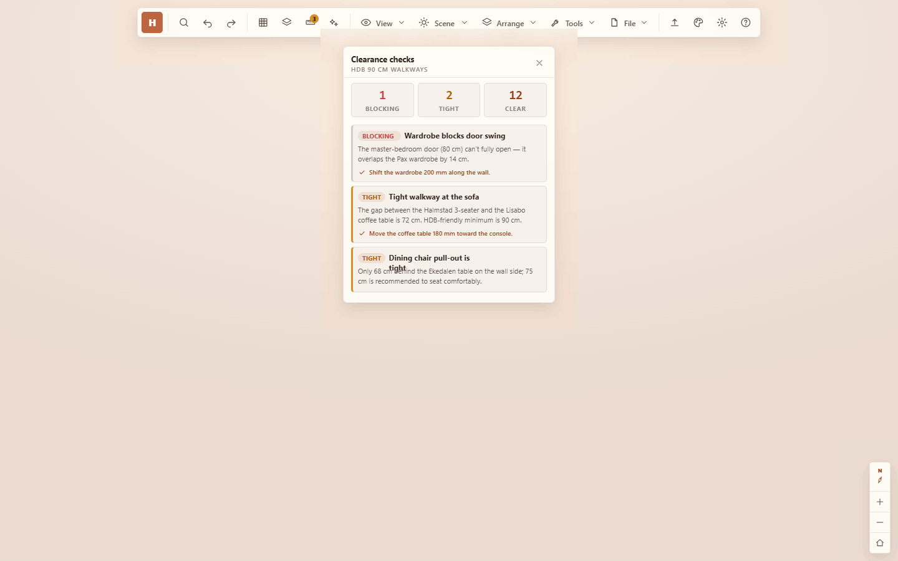
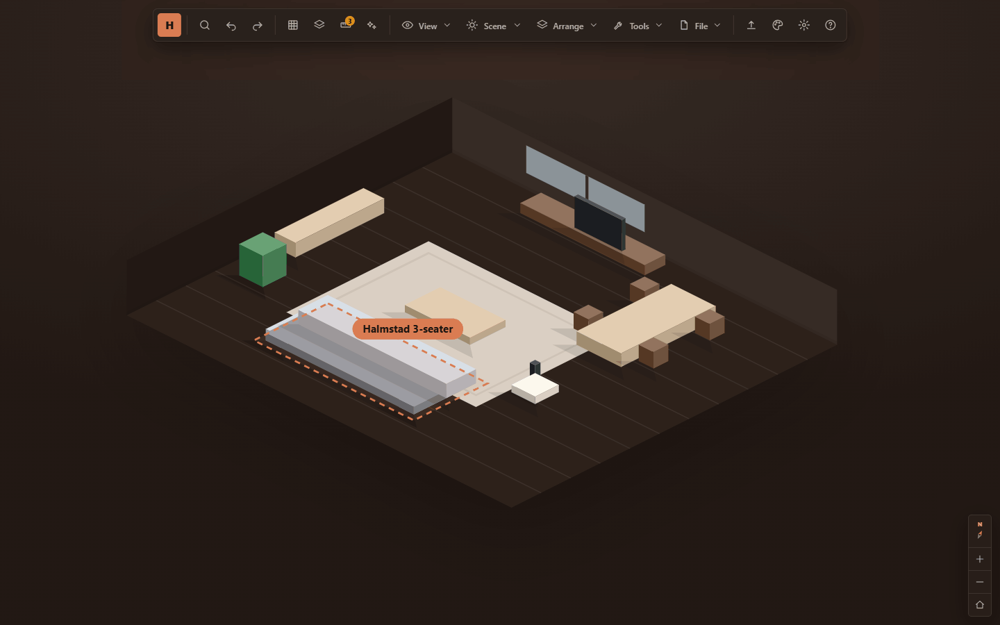

# HDB Interior Design — 3D Sandbox

A high-fidelity, browser-based interior-design prototype for Singapore HDB
flats. Users arrange furniture in a 4-room flat across multiple camera modes,
check real spatial clearances, compare layout versions, and assemble a
shoppable list — all inside a single warm, domestic, Singapore-rooted design
system.


> **Status:** front-end prototype. The 3D scene is a stylised SVG dollhouse,
> and a few terminal actions (cart, PDF/PNG export, align/distribute) confirm
> via toast rather than producing real files. Every interaction model is fully
> built and wired.

---

## 1. Design philosophy

The product is a *creative tool*, so the interface follows the same restraint
mature design tools (Figma, IKEA Kreativ, Planner 5D) use: **the content is the
hero, the chrome recedes.**

- **Minimal always-on chrome.** A single top toolbar plus floating panels that
  appear only when summoned. Nothing competes with the room itself.
- **Progressive disclosure.** Catalog, inspector, clearance, versions, and
  shopping all live in dismissable panels; the accent colour is reserved for
  primary actions and selection, never decoration.
- **One warm system, four moods.** Rather than a generic SaaS blue, the palette
  is domestic and rooted in Singaporean materials — terracotta, kampong green,
  porcelain jade, HDB concrete ochre.
- **Architectural precision.** Sharp corners, a mono typeface for all
  measurements, and a compact pro-tool spacing rhythm signal "instrument," not
  "consumer app."

---

## 2. Theme system

Four themes × two modes (light/dark) = **8 complete palettes**, switched by
`[data-theme]` + `[data-mode]` attributes on the stage container. Every colour
is authored in **OKLCH** for perceptually-even lightness across themes, so the
same UI keeps identical contrast and hierarchy whichever palette is active.

| Theme | Mood | Accent hue | Scene |
|---|---|---|---|
| **Clay** *(default)* | Warm paper + terracotta | `oklch(0.6 0.125 42)` — terracotta | Warm paper |
| **Kampong** | Sand + tropical garden | `oklch(0.55 0.1 152)` — garden green | Sand |
| **Porcelain** | Cool refined neutral | `oklch(0.58 0.075 200)` — teal-jade | Cool grey |
| **Estate** | HDB concrete + ochre | `oklch(0.64 0.12 62)` — amber/ochre | Warm concrete |

Each palette defines a consistent token contract so components never reference
raw colours:

- **Surfaces** — `--surface` (translucent, blurred), `--surface-solid`,
  `--surface-2/3` (raised steps), `--elevated` (popovers).
- **Text** — `--text`, `--text-2`, `--text-3` (three-step hierarchy).
- **Borders** — `--border`, `--border-2`.
- **Accent** — `--accent`, `--accent-2`, `--on-accent`, `--accent-soft`,
  `--accent-soft-text`.
- **Semantic** — `--danger`, `--danger-soft`.
- **Scene** — `--scene-a/b`, `--scene-floor`, `--grid` for the 3D backdrop.
- **Elevation** — `--shadow-panel` (resting), `--shadow-pop` (floating).

Switch themes/modes from the **Appearance** popover in the toolbar; mode
supports Light / Dark / **Auto** (follows the OS).

---

## 3. Typography

- **UI:** Plus Jakarta Sans (400–800) — humanist, friendly, professional.
- **Mono:** JetBrains Mono (400–600) — every dimension, coordinate,
  price, and count, so numbers align and read as instrument data.
- **Scale (px):** `2xs 10 · xs 11 · sm 12 · base 13 · md 14 · lg 16 · xl 20`.
  Deliberately compact — a dense pro-tool rhythm, not a marketing page.

---

## 4. Shape, spacing & motion

- **Radii (sharp / architectural):** `--r-1 3px` (chips, kbd) · `--r-2 5px`
  (buttons, inputs, cards) · `--r-3 7px` (panels) · `--r-pill` (toggles).
- **Spacing scale:** `4 · 6 · 8 · 12 · 16 · 20 · 28 px` — tight, balanced.
- **Motion:** one easing curve `cubic-bezier(0.2,0.8,0.2,1)` and one duration
  `0.16s` throughout. Entrance animations: `fade` (overlays), `pop`
  (popovers/menus), `modalpop` (centered modals).
- **Glass:** floating panels use a 16px backdrop blur over translucent
  surfaces, so the room stays faintly visible behind the chrome.
- **Z-layers:** `hud 10 · panel 20 · pop 40 · overlay 60`.

---

## 5. Camera modes

The stage routes between four modes; nav controls are mode-specific so each
view shows only what's relevant.

| Mode | Purpose | Minimap | Compass | Zoom |
|---|---|:--:|:--:|:--:|
| **Orbit** (dollhouse) | Default arrange-from-above | — | ✓ | ✓ |
| **Walk** (first-person) | Feel the scale at eye level | ✓ | own heading dial | — |
| **Per-room editor** | Repaint walls / swap flooring | — | — | ✓ |
| **2D floor plan** | Schematic top-down | — | — | — |

The compass is **fused into the top of the zoom rail** as one cohesive vertical
control (compass cell → divider → +/−/home), anchored bottom-right.

---

## 6. Features

### Core
- **Catalog** — 75+ items across categories (seating, beds, tables, storage,
  lighting, textiles, plants, kitchen), with Built-in / Browse CC0 / Packs
  tabs, search, category rail, and pagination. Click or drag to place.
- **Inspector** — data-driven from the selected item: transform (X/Z/rotation),
  colour swatches, soft-goods material (Linen/Bouclé/Velvet + sheen), and an
  action grid (rotate, flip, duplicate, lock, delete).
- **Onboarding** — a 3-step intro with "start empty / demo layout / pick a
  preset" branches; persisted via `localStorage`.
- **Layout presets** — curated starting arrangements with budgets.
- **Edit Room** — wall/floor finishes, accent walls, apply-to-all.
- **Appearance** — theme + light/dark/auto switcher.

### Production-grade additions
1. **Swap with similar** — replace a piece in place with same-category
   alternatives, each tagged with a footprint-fit badge (Exact fit / Fits / ±cm).
2. **Clearance & fit checks** — HDB-specific 90 cm walkway + door-swing
   validation. A summary (Blocking / Tight / Clear), an issue list with fix
   suggestions, inline warning chips in the inspector, and flags in the layers
   list. The toolbar shows a live issue count; a smart-guide overlay draws snap
   lines and clearance pills over the scene.
3. **Objects / Layers** — the left dock toggles between Catalog and Layers;
   items grouped by room with select / lock / hide / delete and clearance flags.
4. **Versions** — save, restore, and side-by-side **compare** with layout
   thumbnails and a cost diff.
5. **Shopping list + Collections** — itemised live total with quantity steppers
   and delivery/assembly estimates, plus a **Saved** tab fed by a heart on every
   catalog card.
6. **Share & export** — shareable link, visibility options, PNG / shoppable-PDF
   export.
7. **Command palette (⌘K)** — fuzzy search across actions, panels, views, and
   "add furniture" — fully keyboard-navigable.
8. **Right-click context menu** — swap, duplicate, rotate, align, bring to
   front, lock, hide, delete on any placed item.
9. **Toasts with Undo** — every destructive action (delete, swap, etc.) confirms
   with a non-destructive Undo affordance.
10. **Smart guides** — snap lines + alignment hints in measure mode.

### Feature gallery

**Catalog + Inspector** — browse 75+ items; the inspector drives transform,
colour, material, swap, and per-item actions.


**Objects / Layers** — every placed piece, grouped by room, with select / lock
/ hide / delete and clearance flags.



**Clearance checks** — HDB 90 cm walkway and door-swing validation with fix
suggestions.



**Versions** — save, restore, and compare layouts with thumbnails and cost diff.



---

## 7. Keyboard shortcuts

| Key | Action |
|---|---|
| `⌘K` / `Ctrl-K` | Command palette |
| `⌘S` | Save version |
| `⌘D` | Duplicate selection |
| `C` | Toggle Catalog |
| `Y` | Toggle Objects / Layers |
| `M` | Toggle clearances |
| `R` | Rotate selection 90° |
| `Delete` / `Backspace` | Delete selection |
| `?` | Help & shortcuts |
| `Esc` | Close palette / menu / panel / context menu |
| `↑ ↓ ↵` | Navigate & run command palette |

---

## 8. Architecture

A dependency-free vanilla-JS app. State lives in one object; **pure builder
functions** return HTML strings; a single delegated listener handles events.

```
HDB Sandbox.html        Entry point — links styles, loads scripts in order
assets/
  tokens.css            Design tokens: type, spacing, radii, 8 theme palettes
  components.css        Reusable component styles (buttons, panels, inputs…)
  parts.css             Compound UI (catalog, inspector, navcluster, help…)
  flows.css             Onboarding, presets, edit-room
  screens.css           Appearance, loading, plan, walk
  features.css          Layers, swap, clearance, shopping, versions, share,
                        command palette, context menu, toasts, smart guides,
                        + the re-render guard
  responsive.css        Mobile / small-viewport adaptations
  scene.css / scene.js  The stylised SVG dollhouse backdrop
  icons.js              Stroke line-icon set (24px, round caps)
  app.js                State, render loop, all event wiring, helpers
  flows.js              Onboarding / presets / edit-room builders
  screens.js            Appearance / loading / plan / walk builders
  features.js           All production-feature builders (pure, on window.Features)
```

### Render model
`render()` rebuilds the stage from current state on each change (the `.scene`
backdrop and toast host persist). Builder modules (`Flows`, `Screens`,
`Features`) are pure — they take state and return HTML — so the UI is a direct
function of state.

### Re-render guard (performance)
A naive full re-render on every keystroke/click caused flicker and lost
scroll/focus. Three centralised fixes keep it smooth:

1. **Animation-replay suppression** — surfaces already open before a render get
   a `.no-anim` class via `data-anim-key` tracking, so entrance animations only
   play the first time a surface appears, never on in-panel re-renders.
2. **Scroll preservation** — `render()` snapshots and restores scroll position
   of every scrollable region (catalog, layers, panel bodies, command results).
3. **Partial updates** — per-keystroke surfaces (catalog search, ⌘K results) and
   pure class-toggles (swatches, material) update only their subtree, preserving
   focus and caret.

---

## 9. Responsive & accessibility

- **Responsive:** below 1024px panels narrow; on phones the toolbar collapses
  into a single dropdown sheet, modals fit the viewport, and grids reflow.
- **Hit targets:** controls meet comfortable touch sizes on mobile.
- **Motion:** a single short duration; entrance animations are suppressed on
  re-render (and never loop).
- **Tooltips & shortcuts:** every toolbar control has a tooltip with its
  keyboard hint; the palette and menus mirror all actions for keyboard users.

---

## 10. Running & exporting

**Run locally** — it's a static site with no build step. Open
`HDB Sandbox.html` directly in a modern browser, or serve the folder
(`npx serve` / `python3 -m http.server`) and visit the file. Styles, scripts,
and the scene all load from `assets/` (typefaces come from the Google Fonts
CDN, so the first load needs a connection).

**State & persistence** — onboarding completion is stored in `localStorage`
(`hdb_onboarded`); clear it to replay the intro. Theme, placed furniture,
versions, and collections live in memory for the session.

**Export options inside the app**
- **Share** → copy a view-only link or export a **PNG snapshot** / **shoppable
  PDF**.
- **Shopping list** → "Add all to cart" and "Export shopping list" (CSV).
- **Versions** → save named snapshots and restore / compare them.

> Because this is a front-end prototype, export and cart actions demonstrate the
> flow with a confirmation toast rather than generating real files. The 3D scene
> is a stylised SVG dollhouse, not a true 3D engine.

---

*Built as an HTML design artifact. Open `HDB Sandbox.html` to run.*
