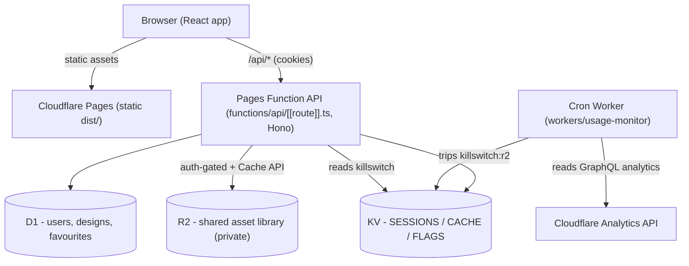

# Deploying to Cloudflare (Pages + Workers, free tier)

This guide deploys Sofa So Good to Cloudflare as a **Pages** site (the static
Vite build) plus a same-origin **Pages Function** API (Workers) bound to **D1**
(accounts, saved layouts, favourites), **R2** (the shared, read-only asset
library), and **KV** (sessions, cache, kill-switch flags). It also ships a
standalone **cron Worker** that acts as a cost circuit-breaker.

The existing **GitHub Pages** deployment keeps working unchanged as a free,
account-less, fully-offline demo — see [GitHub Pages coexistence](#github-pages-coexistence).

- [Architecture](#architecture)
- [What you set up manually](#what-you-set-up-manually-one-time)
- [Provision resources](#provision-resources-wrangler)
- [Configure secrets + bindings](#configure-secrets--bindings)
- [Apply the database schema](#apply-the-database-schema)
- [Populate R2 with the shared library](#populate-r2-with-the-shared-library)
- [Build + deploy the site](#build--deploy-the-site)
- [Deploy the circuit-breaker cron Worker](#deploy-the-circuit-breaker-cron-worker)
- [Cost safety + guardrails](#cost-safety--guardrails)
- [GitHub Pages coexistence](#github-pages-coexistence)
- [Local development against the API](#local-development-against-the-api)

## Architecture



- **Accounts are admin-created only** — there is no public signup. The first
  admin is seeded from secrets; that admin creates everyone else in-app.
- **The R2 bucket stays private** (Worker-only). Assets are served through the
  auth-gated `/api/assets/*` proxy with a long immutable cache, so repeat loads
  are served by the browser / service worker / edge cache and rarely hit R2.

## What you set up manually (one-time)

1. **Create a Cloudflare account** at <https://dash.cloudflare.com/sign-up> (free).
2. **Enable R2.** In the dashboard, go to **R2** and complete the one-time
   activation. R2 requires a payment method on file even on the free tier — the
   [guardrails](#cost-safety--guardrails) below are designed so you never exceed
   the free allowance.
3. **Set a budget alert (recommended).** Billing → Notifications → create an
   alert at your lowest supported threshold so any unexpected spend pings you.
4. **Install Wrangler + log in:**
   ```bash
   npm install                     # wrangler is a devDependency
   npx wrangler login
   ```
5. **(Optional) Custom domain.** Pages gives you `your-project.pages.dev` for
   free. To use your own domain, add it as a **Zone** in Cloudflare (or transfer
   DNS), then Pages → your project → **Custom domains** → add it. Full control of
   subdomain/apex; TLS is automatic.
6. **(Optional) Turnstile (CAPTCHA on login).** Dashboard → **Turnstile** → add a
   widget for your domain. Note the **site key** (public, goes in the frontend
   env) and the **secret** (goes in a Worker secret). Skipping this disables the
   CAPTCHA (fine for a low-traffic private deployment).

## Provision resources (Wrangler)

Each command prints an id — paste it into [`wrangler.toml`](../wrangler.toml).

```bash
npx wrangler d1 create sofa-db
npx wrangler r2 bucket create sofa-assets
npx wrangler kv namespace create SESSIONS
npx wrangler kv namespace create CACHE
npx wrangler kv namespace create FLAGS
```

Fill the placeholders in `wrangler.toml`:
- `database_id` under `[[d1_databases]]`
- `id` under each `[[kv_namespaces]]`

The R2 bucket is referenced by name, so no id is needed there.

## Configure secrets + bindings

**Prerequisite — create the Pages project first.** `wrangler pages secret put`
targets a project that must already exist in your Cloudflare account (an empty
`wrangler pages project list` means you have not created one yet). Either create
it explicitly:

```bash
npx wrangler pages project create sofa-so-good --production-branch main
```

or let the first deploy in [Build + deploy](#build--deploy-the-site) create it
(`wrangler pages deploy --project-name sofa-so-good`).

Secrets are set per-project and never committed:

```bash
# First-admin seed (created automatically on first API request)
npx wrangler pages secret put ADMIN_EMAIL
npx wrangler pages secret put ADMIN_PASSWORD
# Turnstile (only if you created a widget above)
npx wrangler pages secret put TURNSTILE_SECRET
```

> **Rotating credentials after the first login.** `ADMIN_EMAIL` /
> `ADMIN_PASSWORD` seed the very first admin **only** — the seed is skipped once
> that account exists, so changing the secret later does nothing. To change the
> admin password (or anyone's), sign in and use **Manage accounts** → **Edit** on
> the row: set a new password and/or role. Editing your own row keeps you signed
> in (a fresh session is issued); every other session for the edited account is
> revoked immediately and must sign in again. The last remaining admin cannot be
> demoted or deleted.

Non-secret tunables live in `wrangler.toml` `[vars]` (iterations, session TTL,
`MAX_ACCOUNTS`, `MAX_SLOTS_PER_USER`, `MAX_DESIGN_BYTES`) and can be changed
without touching code.

Frontend build env (Cloudflare Pages → Settings → Environment variables, or a
local `.env` — see [`.env.example`](../.env.example)):

| Variable | Value | Effect |
| --- | --- | --- |
| `VITE_API_BASE` | `/api` | Turns on accounts + cloud sync (`hasBackend()`). |
| `VITE_BASE` | `/` | Serve at the site root (GitHub Pages uses `/sofa-so-good/`). |
| `VITE_TURNSTILE_SITE_KEY` | your site key | Shows the login CAPTCHA. |

## Apply the database schema

```bash
npx wrangler d1 migrations apply sofa-db --remote
```

Schema: [`migrations/0001_init.sql`](../migrations/0001_init.sql) — `users`,
`designs` (JSON of the client `SerializedState`), `favourites`.

## Populate R2 with the shared library

R2 holds a **read-only shared library that you populate once from your machine**.
There is **no write path from the app into R2** — in-app user uploads stay local
in the browser (IndexedDB), so R2 growth is entirely under your control.

1. Build the manifest the app fetches:
   ```bash
   npm run build-library-index          # scans ikea_optimized/ -> ikea_optimized/library-index.json
   ```
2. Upload the tree + manifest. Configure an `rclone` remote for R2 (S3-compatible;
   endpoint `https://<accountid>.r2.cloudflarestorage.com`). Bucket-scoped API
   tokens cannot call `ListBuckets` or `CreateBucket`, so set `no_check_bucket =
   true` and always address the bucket explicitly (`remote:sofa-assets/...`, not
   `remote:` alone):
   ```ini
   # ~/.config/rclone/rclone.conf
   [sofa-r2]
   type = s3
   provider = Cloudflare
   access_key_id = <R2 access key>
   secret_access_key = <R2 secret>
   endpoint = https://<accountid>.r2.cloudflarestorage.com
   acl = private
   no_check_bucket = true
   ```
   ```bash
   # objects land at ikea/<group>/... and library/index.json (the keys the proxy serves)
   rclone copy ikea_optimized sofa-r2:sofa-assets/ikea --transfers=32 --checkers=32 \
     --exclude 'library-index.json'
   rclone copyto ikea_optimized/library-index.json sofa-r2:sofa-assets/library/index.json
   ```
   The proxy maps `/api/assets/ikea/<group>/<file>` → the R2 key
   `ikea/<group>/<file>`, and `/api/assets/library/index.json` → `library/index.json`.

> **Licensing.** The IKEA library is non-redistributable, so R2 serves it **only
> to signed-in users** through the auth gate — it is never public. Keep the
> bucket private.

Once R2 is populated, the library **auto-populates the in-app catalog grid** for
any signed-in **admin** (no manual add step): opening the catalog fetches
`library/index.json` once and every product appears as a browsable card in its
category tab, downloading its GLB only when placed. This is gated by the
`sharedLibrary` feature flag (simple tier, on by default) plus the admin role. The manifest is built by
`node scripts/build-library-index.mjs` and must include each product's
`groupKey` (emitted automatically — a manifest built before groupKey existed
collapses the grid to a single card; the client backfills it from `group` as a
safety net, but re-upload a current manifest). The manifest is served
**no-store** (never edge/SW-cached, unlike the immutable product assets), so a
re-uploaded `library/index.json` is picked up on the next catalog open with no
cache purge or redeploy.

## Build + deploy the site

Cloudflare's build automatically bundles `functions/` into the API Worker.

```bash
VITE_API_BASE=/api VITE_BASE=/ npm run build
npx wrangler pages deploy dist --project-name sofa-so-good
```

Or connect the Git repo in the Pages dashboard with build command
`npm run build`, output `dist`, and the env vars above — every push deploys.

### Automated CI/CD (GitHub Actions)

`.github/workflows/deploy-cloudflare.yml` builds the backend-enabled bundle and
deploys it via [`cloudflare/wrangler-action`](https://github.com/cloudflare/wrangler-action)
on every push to `main` (and on manual dispatch), so `sofa-so-good.pages.dev`
tracks `main` without manual `wrangler pages deploy` runs. This is separate from
`deploy.yml`, which keeps shipping the offline GitHub Pages demo. To enable it:

1. **Create a Cloudflare API token** (dashboard → My Profile → API Tokens) with
   **Account → Cloudflare Pages: Edit** and **Account → Workers Scripts: Edit**.
2. **Add repo secrets** (GitHub → Settings → Secrets and variables → Actions):
   - `CLOUDFLARE_API_TOKEN` — the token above
   - `CLOUDFLARE_ACCOUNT_ID` — your account id (`wrangler whoami`)
   - `VITE_TURNSTILE_SITE_KEY` *(optional)* — the login CAPTCHA site key

Project secrets (`ADMIN_EMAIL`/`ADMIN_PASSWORD`/`TURNSTILE_SECRET`) and the
`wrangler.toml` bindings are read by Cloudflare at deploy time — the workflow does
not re-set them. **Pick one path**: either this workflow *or* the dashboard Git
connection above, not both, or every push deploys twice. Migrations, R2 uploads,
and the cron Worker stay manual (see the sections below).

## Deploy the circuit-breaker cron Worker

Pages Functions cannot run scheduled/cron handlers, so the usage monitor ships as
its own Worker.

1. Point its KV `id` at the **same** `FLAGS` namespace and set `CF_ACCOUNT_ID` in
   [`workers/usage-monitor/wrangler.toml`](../workers/usage-monitor/wrangler.toml).
2. Create an API token (dashboard → My Profile → API Tokens) with **Account
   Analytics: Read**, then:
   ```bash
   cd workers/usage-monitor
   npx wrangler secret put CF_API_TOKEN
   npx wrangler deploy
   ```

It polls R2 usage every 4 hours and sets `killswitch:r2` in KV when usage crosses
`TRIP_FRACTION` of the free allowance; it clears it after the monthly reset.

## Cost safety + guardrails

Multiple independent layers keep the bill at **$0**:

- **Private bucket + auth gate.** R2 is Worker-only and served only to signed-in
  users; no public signup means no anonymous fan-out.
- **Cache-first reads.** Assets carry `immutable` cache headers and are fronted by
  the Worker Cache API, so repeat reads rarely reach R2 (Class B ops guardrail).
- **Self-imposed circuit breaker.** The cron Worker trips `killswitch:r2` at
  ~95% of the free R2 allowance. When tripped, `/api/assets/*` serves cache-only
  and returns `503` on a cold miss — **zero new R2 reads** until the monthly reset
  clears it.
- **Manual master kill-switch.** Set `killswitch:all=1` in the `FLAGS` KV to
  return `503` for the whole API instantly:
  ```bash
  npx wrangler kv key put --binding FLAGS killswitch:all 1
  # or just R2:
  npx wrangler kv key put --binding FLAGS killswitch:r2 1
  ```
- **Write-budget discipline (D1/KV free caps).** Cloud autosave is throttled to
  ≤1 write/60 s (still saved locally every change); login writes a single KV
  session key; per-user caps on saved slots (`MAX_SLOTS_PER_USER`) and design
  size (`MAX_DESIGN_BYTES`); account cap (`MAX_ACCOUNTS`).
- **Graceful degradation.** Every cloud write falls back to local storage on
  error, so hitting a free cap never blocks the user — they keep working offline
  and sync catches up later.
- **Abuse guards.** Turnstile on login, best-effort per-isolate rate limiting on
  `/api/auth` + `/api/assets`, and (recommended) a Cloudflare **WAF rate-limiting**
  rule on `/api/auth/*` and `/api/assets/*` in the dashboard.

## GitHub Pages coexistence

The GitHub Pages workflow is unchanged. Because the client gates all backend
features on `VITE_API_BASE` (`hasBackend()`), a build without it (GitHub Pages)
has **no cloud login, no cloud sync, and no shared-library browser** — it stays
the existing local-only, offline PWA. The Cloudflare build (with `VITE_API_BASE`
set) is the full-featured version.

## Local development against the API

### Default: `npm run dev` (Node dev backend)

`npm run dev` runs the Vite app **and** a local backend together, so real admin
login + cloud sync work in dev with no extra steps:

```bash
cp .dev.vars.example .dev.vars   # first time only — seeds the dev admin account
npm run dev                      # Vite :5173 + backend :8788 (Vite proxies /api)
```

The backend (`scripts/dev-api.ts`) hosts the **actual** Cloudflare Worker app
(`functions/api/[[route]].ts`) on Node with shimmed bindings — `node:sqlite` for
D1 (persisted to `.wrangler/sofa-dev.sqlite`), an in-memory Map for KV/sessions,
and a **filesystem mirror of the R2 shared-library bucket** so the admin catalog
populates in dev too. R2's contents are just the local `ikea_optimized/` tree
(the same one `rclone`d to the bucket — see below), so the shim serves those keys
straight from disk: `ikea/<group>/<file>` → `ikea_optimized/<group>/<file>` and
`library/index.json` → `ikea_optimized/library-index.json` (run
`npm run build-library-index` once to produce it). Override the source dir with
`DEV_LIBRARY_DIR`; if it's absent the shared library just stays empty. The admin
is seeded from `.dev.vars` (`ADMIN_EMAIL`/`ADMIN_PASSWORD`) on the first request;
sign in with those on the login screen. Turnstile is skipped when
`TURNSTILE_SECRET` is empty. Requires Node ≥ 22 (`node:sqlite`); run either half
alone with `npm run dev:web` / `npm run dev:api`.

**Why not `wrangler pages dev`?** `workerd` (wrangler's local runtime) needs
glibc ≥ 2.32, which some dev boxes (Ubuntu 20.04 / WSL, glibc 2.31) don't have.
The Node backend runs the same worker code without `workerd`. If your machine has
glibc ≥ 2.32 you can still use Wrangler instead:

```bash
npm run build
npx wrangler pages dev dist --d1 DB=sofa-db --kv SESSIONS --kv CACHE --kv FLAGS --r2 LIBRARY=sofa-assets
```

Either way, point a split Vite dev server at a running API with `VITE_API_BASE`
if you want the two on separate origins.
