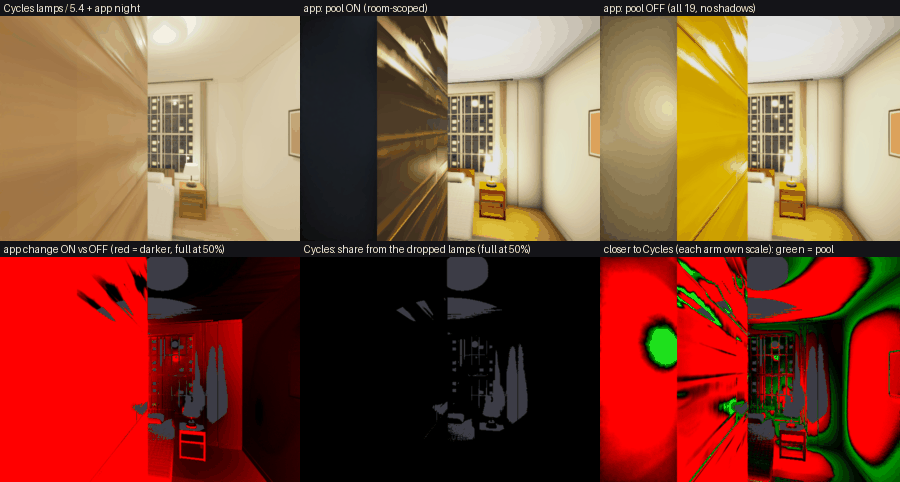
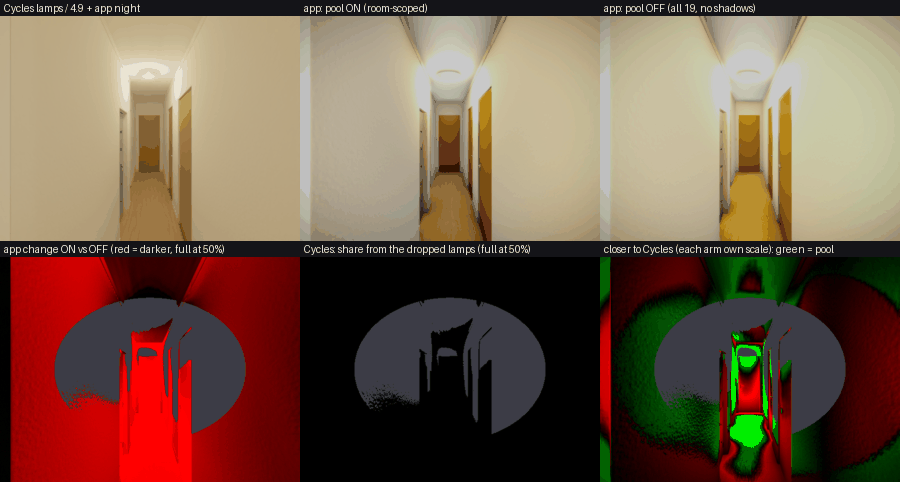
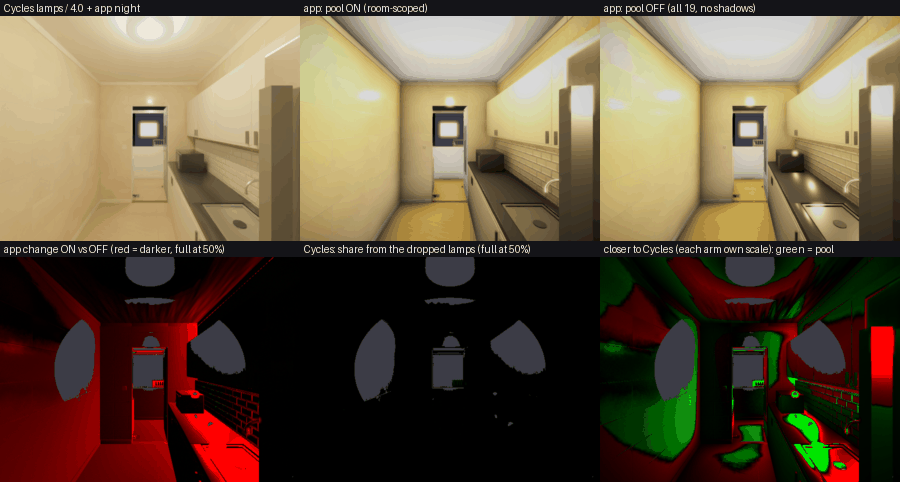
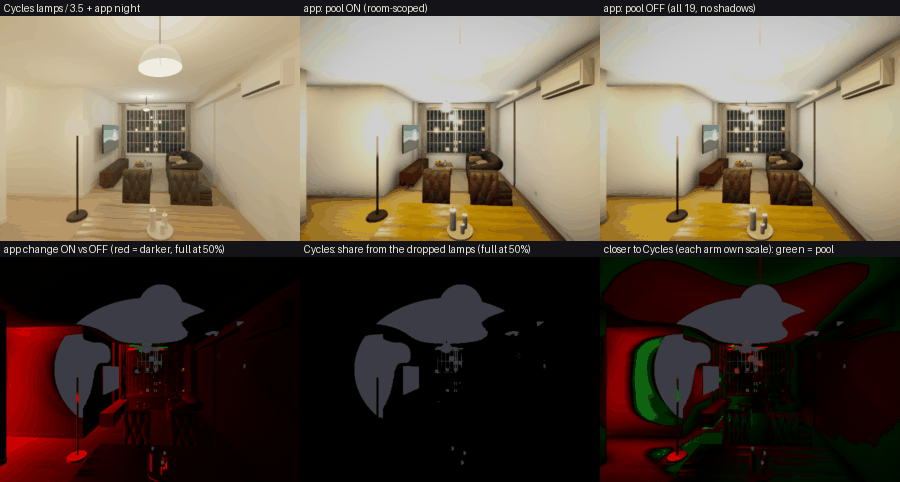
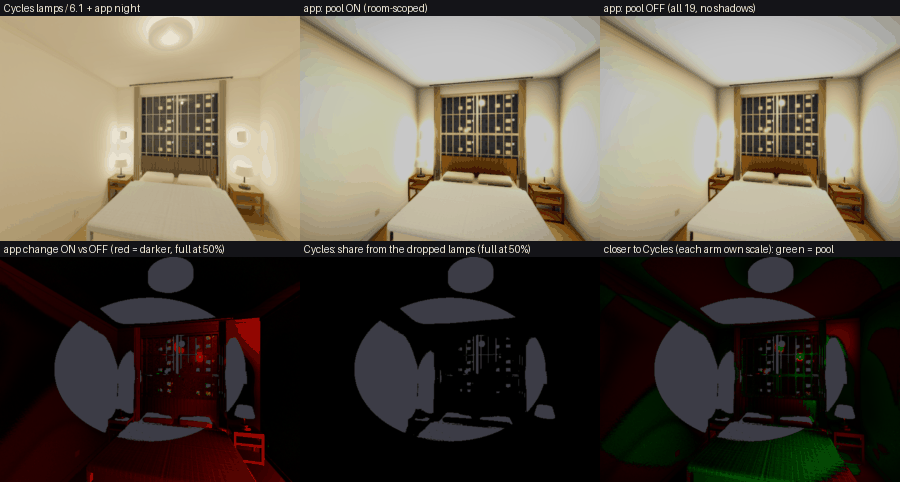

# Is the room-scoped light pool's darkening physically correct? (R7-AH, 2026-09-26)

**Question.** R7-AE (`06bab7c9`, `roomScopedLights`) cut the fixture point lights to a room-scoped
pool of 8. The lights cast no shadows, so before that a lamp lit walls through other walls. Every
changed pixel got darker (bedroom 2 −32 %, corridor −17 %, kitchen −7 %, living −3 %, main bedroom
−2 %; `lights-gpu-bound-2026-09-25.md` §10.2). Nobody had checked that against Cycles. This does.

**Verdict: a correction. Keep it; nothing in `src/` changes.** Cycles puts **0.000 %** of the lamp
light in every measured region on the lamps the pool drops. The worst region anywhere is 0.06 %
(the kitchen, through the open service-yard door). That holds with every bounce counted, and it
still holds with the app's `distance` cutoff removed. The through-wall light was spurious, and none
of it should come back as bounce: the Cycles `rest` render already includes all interreflection.

**The catch.** Without the leak, the picture drifts further from Cycles' spatial *distribution*,
not closer to it. Scale each arm by its own best scalar and the legacy arm matches Cycles' shape
better (bedroom 2: 9 % mean region error against the pool's 51 %). The leak was broad,
low-gradient light, which is what interreflection looks like. It was standing in for a term the
app barely has. The app's lamp light is roughly Cycles' **direct** term alone. Cycles' total is
**3.5–6× larger**, because in these near-white rooms most lamp light arrives by interreflection.
That is a separate, pre-existing deficit (the lamps-on GI of §5 Stage 3 in the research doc). It
is not a pool over-correction, and putting the leak back to hide it would be the wrong fix.

## 1. Method

One boot of the app, one Cycles scene built from that boot's export, and five poses. The poses
are R7-AE's `--mode visual` set: bedroom 2 `(4.9, 3.4)` yaw 0.2; corridor `(8.8, 4.3)` yaw π/2;
kitchen `(9.3, 8.0)` yaw π/2; living `(11, 7)` yaw 0.07; main bedroom `(1.9, 3.4)` yaw 0.25. All
are at pitch 0, 1200×900, DPR 1, `realistic`, 21:00, lights on, with the shipped doors (every
interior door closed, the service yard's open).

### 1.1 App side — `scripts/dev-probes/room-lights-cycles.mjs` (one boot)

- `ssg_linear_view` was set before the first frame, so each frame inverts exactly as
  `linear = srgb_to_linear(byte) / toneMappingExposure` (`src/scene/linearView.ts`).
  `toneMappingExposure` read **0.897** in every capture. R7-AE's "linear" was sRGB-decoded
  *AgX* output, which compresses highlights. That is why the removed shares below are larger than
  R7-AE's (corridor 27.9 % against 17 %).
- Pinned off before any capture: `ceilingExposure`, `windowBlowoutAdaptive` and
  `interactiveDegrade`. Device class and the adaptive setters were pinned too.
- Four captures per pose from the real pipeline's drawing buffer (no HUD), changing one thing at a
  time:
  - `pool`: the flag on;
  - `legacy`: the flag off;
  - `pool2`: the flag on again, as the noise-floor control;
  - `dark`: the lights switch off.

  The control matched `pool` to ≤ 0.05 % in every region, except one living region at 0.57 %.
- **Lamp contribution** is `A_arm = lin(arm) − lin(dark)`. That removes the night sky, the estate
  backdrop and the daylight bake, and keeps everything the lights switch drives (the point lights,
  `lampBounce`, fixture glow and bloom).
- Pool membership per pose comes from the live slots, matched to the 19 fixtures by position and
  intensity (an exact match, so nothing was merged). Bedroom 2 carries 2 lamps, corridor, kitchen
  and living carry 7, and the main bedroom carries 6.
- Then, in the same boot and in **walk mode**, the flag goes off so all 19 fixtures are ordinary
  scene lights. The scene is exported through the app's own `buildExportRoot` + `exportGlb`
  (102.9 MB). The manifest records each fixture's world position, three intensity, colour,
  `distance` and decay, plus each pose's camera `matrixWorld`, fov (76.457° vertical) and aspect
  (4:3).

### 1.2 Cycles side — `python/scripts/blender/render_lamp_groups.py`

**The light-unit conversion is `P [W] = 4π · I [three intensity, cd]`.** three's shadowless point
light shades a Lambert surface to `albedo/π · I · cosθ / d² · window(d)`. A Blender point lamp of
power `P` has radiant intensity `P/(4π)` W/sr and shades the same surface to
`albedo/π · P/(4π) · cosθ / d²`. Neither renderer applies a luminous efficacy to a pixel.
`--selftest` measures this with a 0.5-albedo floor and a lamp of I = 9 at 2 m, rather than
trusting the algebra. Cycles and the formula agree to **0.998–1.001** out to 6.3 m.

**The export does carry the lights, but the importer converts them wrong for this purpose.** The
GLB has all 19 fixtures in `KHR_lights_punctual`, at the right positions (plus the zero-strength
sun). Blender's glTF importer brings in I = 4 cd as **0.0736 W**, which is `4π · 4 / 683`: its
"physical" mode divides by 683 lm/W. Used as is, every lamp would be 683× too dim against the
app's pixels. So the imported lights are deleted and re-placed from the manifest at `4π·I`.

**The app's `distance` cutoff is reproduced.** three multiplies by
`clamp(1 − (d/distance)⁴, 0, 1)²`. Each Cycles lamp gets a light-shader node tree that applies the
same function of Light Path → Ray Length. The self-test agrees within 1 % out to 4 m. Near the
cutoff it reads 2–5 % high on values under 1 % of the peak, where a 3-pixel average sits across the
steep gradient. `--no-window` drops the cutoff and gives pure inverse square. Every conclusion
below was re-run that way and did not move (§2).

**Made to match the app, not reality.** With these in place, the only differences left between the
two rigs are the two physics questions under test: occlusion and interreflection.

- The 29 emissive materials (lamp-shade glow, the glazing sky-catch) are camera-only. They are look
  devices that light nothing in the app.
- The 44 fixture meshes whose bounds contain a bulb (shades, pendants) are camera-only. The app's
  lamps are omnidirectional and ignore their own shade. An opaque Cycles shade would swallow a
  table lamp.
- The world is black. Everything non-lamp is the app's `dark` frame, which is subtracted.
- The camera is three's `matrixWorld`, left-multiplied by the Y-up→Z-up matrix, with
  `sensor_fit = VERTICAL`, the same fov and 600×450 (4:3). The app frames are 2×2-averaged in
  linear to match.

Per pose, three renders at 1024 samples, OIDN-denoised, 12 diffuse bounces, Metal (Apple M4
GPU). Ten minutes for all five poses.

- `none`: no lamps (only the camera-only emissives, which every render carries);
- `pool`: the pool's lamps;
- `rest`: the dropped lamps.

`C = (pool − none) + (rest − none)` is the whole rig. `Cr = rest − none` is what physics says the
dropped lamps are worth, bounce included. A fourth arm, `--direct-only` (0 bounces), gives the
pool lamps' shadowed direct term.

**Noise.** A seed pair (seed 0 against 1) of the pool render gives these figures at bedroom 2 and
the corridor:

- frame means agree to 0.03 % and 0.02 %;
- per-pixel |Δ|/mean has median 0.8 % / 0.5 % and p95 5.3 % / 2.7 %;
- 8×8-block p95 is 2.2 % / 1.7 %.

So region means carry ≪ 1 % noise, against effects of 3–86 %.

### 1.3 Comparison — `scripts/dev-probes/room-lights-compare.py`

- **Luminance:** Rec.709, scene-linear.
- **Excluded pixels:**
  - anything clipped in any app arm (the linear view clips at 1/0.897; 8–21 % of pixels, the lamp
    hot spots);
  - the emissives;
  - anything Cycles lights at < 1e-4 (the exterior through the glass).
- **Regions** are not hand-placed. Each is the camera's room crossed with a surface class, taken
  from Cycles' own position and normal passes:
  - a wall class only where the surface lies within 0.2 m of that room boundary;
  - floor below 0.05 m, ceiling above 2.3 m;
  - everything else in the room is "furniture / fittings".
- **Columns:**
  - *Cyc*: the Cycles lamp light, `C`.
  - *drop%*: `Cr / C`, the share of `C` from the lamps the pool drops.
  - *pool* and *legacy*: the app lamp light for each arm, `A_arm`.
  - *app rm%*: `1 − A_pool/A_legacy`.
  - *err*: the absolute error `A/C − 1`.
  - *errS*: the SHAPE error. Each arm is scaled by its own whole-frame scalar `k_arm = ΣC/ΣA_arm`,
    so a uniform level gap cannot favour either arm.
  - *CycDir*: the pool lamps' shadowed direct light only.

## 2. The direction test — what the pool removed, against what Cycles says was there

| pose | app removed (frame) | Cycles: share from dropped lamps, frame / worst region | same, no `distance` cutoff |
|---|---|---|---|
| bedroom 2 | **34.1 %** | **0.000 % / 0.000 %** | 0.0000 % |
| corridor | **27.9 %** | **0.000 % / 0.000 %** | 0.0002 % |
| kitchen | 9.8 % | 0.003 % / 0.062 % | 0.003 % |
| living | 5.5 % | 0.000 % / 0.000 % | 0.002 % |
| main bedroom | 3.1 % | 0.000 % / 0.000 % | 0.0000 % |

The per-region table (§3) shows the same thing everywhere, with the `rest` render equal to the
`none` render to five decimals. The dropped lamps sit behind closed doors: bedroom 3, the
bathrooms, the shelter, the corridor pendant seen from bedroom 2, and the main bedroom's lamps.
Physically, no path carries their light into the camera's room, first bounce or fifth. Where the
pool keeps a lamp, the lamp is in the camera's room or visibly connected to it, and Cycles agrees
that is where the light comes from.

**Should any of it have come back as bounce?** No. `Cr` includes every bounce and it is zero. The
app's `lampBounce` is per room and fed only by that room's own lamps (`lampBounce.ts`), which is
the right attribution as well.

**A correction to R7-AE's account.** R7-AE said bedroom 2's "wardrobe front" was lit through the
party wall by the main bedroom's sconce and table lamp. It was not. That surface is a wood
furniture panel at x = 4.83 facing +x, 8 cm from the lens at this pose (raycast: `caa478`, a
`MeshStandardMaterial` in a furniture group). The main-bedroom lamps (x ≤ 2.93) are behind its
normal and give it exactly 0. Its leaked light came from lamps to its EAST, through the corridor
wall. Computed per lamp with three's own formula at the panel centre:

- the corridor pendant (6.33, 2.5, 4.33): 1.63;
- bedroom 3's ceiling light: 0.77;
- the shelter light: 0.41;
- everything else: < 0.05.

## 3. Per region — absolute level and shape, each arm against Cycles

Each errS pair has its winner in bold (smaller |errS| is closer to Cycles' distribution).

**bedroom 2** (pool: 2 lamps; k_pool 5.44, k_legacy 3.59)

| region | px | Cyc | drop% | pool | legacy | app rm% | err pool | err legacy | errS pool | errS legacy | CycDir |
|---|---|---|---|---|---|---|---|---|---|---|---|
| wall facing −x (east wall) | 40 869 | 2.077 | 0.00 | 0.546 | 0.577 | 5.4 % | −74 % | −72 % | +43 % | **−0.4 %** | 0.654 |
| wall facing +z (north) | 29 073 | 1.262 | 0.00 | 0.207 | 0.272 | 24.1 % | −84 % | −79 % | **−11 %** | −23 % | 0.315 |
| floor | 10 049 | 0.735 | 0.00 | 0.178 | 0.208 | 14.4 % | −76 % | −72 % | +32 % | **+2 %** | 0.157 |
| ceiling | 26 065 | 2.347 | 0.00 | 0.623 | 0.641 | 2.7 % | −73 % | −73 % | +45 % | **−2 %** | 0.935 |
| furniture (the 8 cm panel dominates) | 143 583 | 0.684 | 0.00 | **0.046** | 0.210 | **78.0 %** | −93 % | −69 % | −63 % | **+10 %** | **0.048** |

**corridor** (pool: 7 lamps; k 4.90 / 3.53)

| region | px | Cyc | drop% | pool | legacy | app rm% | err pool | err legacy | errS pool | errS legacy | CycDir |
|---|---|---|---|---|---|---|---|---|---|---|---|
| wall facing +x (west end) | 6 851 | 0.740 | 0.00 | 0.110 | 0.261 | 57.9 % | −85 % | −65 % | −27 % | **+25 %** | 0.091 |
| wall facing +z (south side) | 85 352 | 2.317 | 0.00 | 0.554 | 0.726 | 23.7 % | −76 % | −69 % | +17 % | **+11 %** | 0.431 |
| wall facing −z (north side) | 79 752 | 2.377 | 0.00 | 0.427 | 0.667 | 35.9 % | −82 % | −72 % | −12 % | **−1 %** | 0.258 |
| floor | 10 640 | 0.839 | 0.00 | 0.128 | 0.290 | 55.7 % | −85 % | −66 % | −25 % | **+22 %** | 0.103 |
| ceiling | 15 802 | 3.362 | 0.00 | 0.564 | 0.632 | 10.8 % | −83 % | −81 % | **−18 %** | −34 % | 0.425 |
| furniture / fittings | 15 309 | 2.172 | 0.00 | 0.468 | 0.523 | 10.6 % | −79 % | −76 % | **+6 %** | −15 % | 0.868 |

**kitchen** (k 4.01 / 3.62), **living** (k 3.50 / 3.31), **main bedroom** (k 6.06 / 5.87): the
pool removes 0–24 % per region, and Cycles' dropped share is 0.00 % in every region except the
kitchen's view out of the room (0.06 %). In those three poses the errS of the two arms stay within
a few points of each other, except for:

- the kitchen floor: pool −27 %, legacy −13 %;
- the kitchen west wall: −17 % / −12 %;
- the living floor: −14 % / −5 %;
- the view out of the living room (its west party wall with bedroom 3): −20 % / −6 %.

Full tables: `compare.json` from the script (not committed; rerun the three commands in §6).

**Pixel-weighted mean |errS| over the camera room's regions:**

| pose | pool | legacy |
|---|---|---|
| bedroom 2 | 50.7 % | 8.8 % |
| corridor | 15.1 % | 10.0 % |
| kitchen | 13.0 % | 12.4 % |
| living | 10.6 % | 7.8 % |
| main bedroom | 21.8 % | 22.2 % |

**Reading it:**

- **The absolute level is 70–93 % below Cycles in both arms, and the change is not the reason.**
  The app's lamp light matches Cycles' *direct* term to within ~0.6–1.3×. Examples, pool against
  CycDir:
  - bedroom 2 east wall: 0.55 / 0.65;
  - bedroom 2 panel: 0.046 / 0.048;
  - kitchen ceiling: 0.59 / 0.91;
  - corridor south wall: 0.55 / 0.43.

  Cycles' total is 2.5–5× its own direct term. The walls export at `f5f5f0` (~0.91 linear albedo),
  and in a small room that white, most lamp light arrives by interreflection. `lampBounce` supplies
  a small part of it, and only to the lightmapped shell. Furniture gets none, which is why the
  bedroom-2 panel is black under the pool: 93 % of its Cycles light is bounce.
- **Shape favours the legacy arm, for a bad reason.** The leak came from 2–7 lamps 2–6 m away,
  unshadowed. That is broad, low-gradient light, the same spatial signature as interreflection, so
  it partly filled the missing GI. It does so from the wrong sources, in the wrong amount per room,
  and it leaves the lit rooms (living, main bedroom) exactly as far off as before.
- **The two ways to close the shape gap are not equivalent.** Re-admitting the leak, e.g. as a
  dimmed through-wall term, would add light that Cycles says is 0.000 % present. Adding own-lamp
  interreflection, which is what Cycles says is missing, fixes the pool arm and the lit rooms
  together.

## 4. What a viewer notices (the sheets)

Each sheet has two rows:

- **top:** Cycles' lamp light ÷ k_pool plus the app's night frame (level-matched, so it shows
  shape), then the app with the pool ON, then the app with the pool OFF;
- **bottom:**
  - the app's change, where red = darker, full scale at 50 %;
  - Cycles' share from the dropped lamps, where black = none;
  - which arm is closer to Cycles, each arm at its own scale: green = pool, red = legacy; grey =
    excluded (clipped lamp hot spots, emissives).

**Bedroom 2.**

- The loudest difference is the panel filling the left 40 % of the frame. Under the pool it is
  near-black with specular streaks. In the legacy arm it is a flat bright yellow. In Cycles it is
  a soft warm tan, lit by the room's own two lamps bouncing off the white walls.
- Neither app arm looks like Cycles there. The legacy arm is closer in level, for the wrong
  reason: lamps behind the corridor wall.
- The middle bottom panel is solid black: physics puts no dropped-lamp light anywhere in the room.
- Elsewhere, Cycles shows a much softer room. The ceiling wash spreads further, and the corners
  and the floor under the bedside table are filled.
- **This pose is a poor room pose.** The camera stands 8 cm from a furniture panel, so 58 % of the
  valid pixels are one surface. The R7-AE bedroom-2 headline (−32 %) is mostly that panel.

**Corridor.**

- Cycles is evenly lit, falling off gently toward the far end.
- The pool arm is a slightly darker, flatter version of the same. The legacy arm is a warmer,
  brighter wash, most visibly on the near floor and the west end wall. That wash came from five
  rooms' lamps through closed doors.
- The "closer" map is green over most of both long walls (the pool is closer), with red bands at
  the near floor and the end wall.

**Kitchen.**

- The pool mainly darkens the floor, the west wall and the hob/counter reflections. The shelter
  light behind the west wall and the corridor pendant were lighting them.
- Cycles' counter and floor are softer and brighter than either arm.
- The "closer" map is mostly green on the walls and red on the floor.

**Living.**

- Hardly any visible change, except the left (west) wall near the floor lamp: bedroom 3's ceiling
  light no longer shines through it.
- Cycles lights that wall more evenly and more brightly, by bounce from the living lamps.

**Main bedroom.**

- A 3 % change, hard to see side by side; the bottom-left heat panel is faint red on the right wall and the bedside tables.
- The Cycles frame differs from both arms in the same way. The sconce hot spots are much weaker
  relative to the room, and the headboard wall and the floor are filled.
- This is the GI gap on its own, with no pool involvement.

## 5. Verdict and what to do next

**Correction — keep `roomScopedLights` as shipped.** On the direction question the evidence is
unambiguous. The pool removed 3–34 % of the lamp light per frame, and 58–78 % in the worst regions.
Cycles puts ≤ 0.06 % of the light in any region on those lamps, with or without the app's distance
cutoff. No bounded fix is proposed behind the flag, because there is no over-correction to fix.

**Mixed on appearance, and the cause is not the pool.** The removed light happened to resemble the
interreflection the app does not model. So in bedroom 2 and the corridor the pool frame is further
from Cycles' distribution than the legacy frame was (mean |errS| 51 % against 9 %, and 15 % against
10 %). That is the pre-existing lamp-GI deficit. At the level the app's own direct light already
matches, Cycles adds another 2.5–5× by interreflection. The deficit is largest on surfaces facing
away from their room's lamps, and on furniture, which `lampBounce` does not reach. It belongs to
§5 Stage 3 of `lights-gpu-bound-2026-09-25.md` (a lamps-on bake for the shell; `LightProbeGrid` for
furniture). These renders are a ready-made reference for it:

- `render_lamp_groups.py` with `--groups all` gives the target;
- `--direct-only` gives the part the app already has.

**Two caveats before anyone fits a level to these numbers:**

1. The magnitude of the GI gap scales with albedo. The exported walls are ~0.91 linear, brighter
   than most real paint (~0.8).
2. The earlier lights-on reference that calibrated `lampBounce` (`v0.33.0.3`, "kitchen ceiling
   184 vs Cycles 190") left the fixture meshes opaque. Pendant and table-lamp shades there
   absorbed much of each lamp. It was also compared in AgX counts at exposure 1.38. So its level
   and this one are not the same quantity.

## 6. Reproduce

    # app (one boot; waits on sofa-shot-harness.lock and the Chrome budget)
    npx vite --port 5431 --strictPort --force &
    SSG_URL=http://localhost:5431/ node scripts/dev-probes/room-lights-cycles.mjs --out /tmp/r7ah/app
    # Cycles (Metal GPU: ~10 min for the main set; ~1 min each for the controls)
    blender --background --factory-startup --python python/scripts/blender/render_lamp_groups.py -- \
      --selftest --out /tmp/r7ah/selftest --samples 256 --device CPU
    blender --background --factory-startup --python python/scripts/blender/render_lamp_groups.py -- \
      --dir /tmp/r7ah/app --out /tmp/r7ah/cyc --samples 1024
    blender ... render_lamp_groups.py -- --dir /tmp/r7ah/app --out /tmp/r7ah/cyc-direct \
      --samples 512 --direct-only --no-passes --groups none,pool
    blender ... render_lamp_groups.py -- --dir /tmp/r7ah/app --out /tmp/r7ah/cyc-nowin \
      --samples 1024 --no-window --no-passes --groups none,rest
    # compare + sheets
    python3 scripts/dev-probes/room-lights-compare.py --app /tmp/r7ah/app --cyc /tmp/r7ah/cyc \
      --cyc-direct /tmp/r7ah/cyc-direct --out /tmp/r7ah/cmp \
      --sheets docs/research/assets/room-scoped-lights-cycles-2026-09-26
